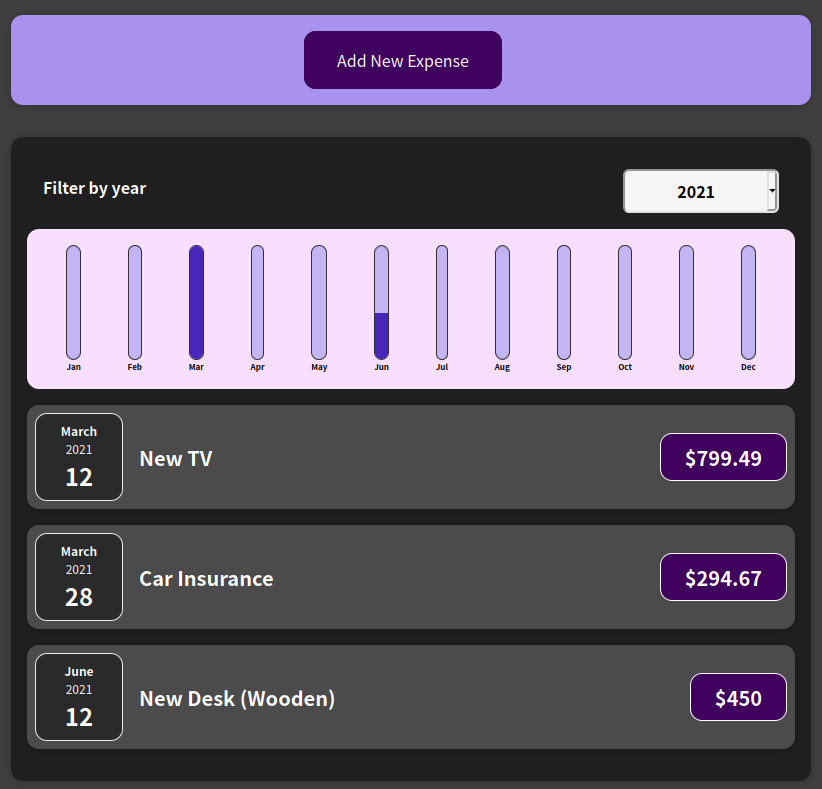

# Expense Tracker

## 💻 Description

This project is a basic ReactJS Web Application made to track the expenses of user. This project contains no backend integrations.

This is a code along project that was made while watching [React - The Complete Guide (incl Hooks, React Router, Redux)](https://www.udemy.com/course/react-the-complete-guide-incl-redux/) by [Maximilian Schwarzmüller](https://www.udemy.com/user/maximilian-schwarzmuller/).

## 📷 ScreenShots

<kbd>
  
</kbd>
